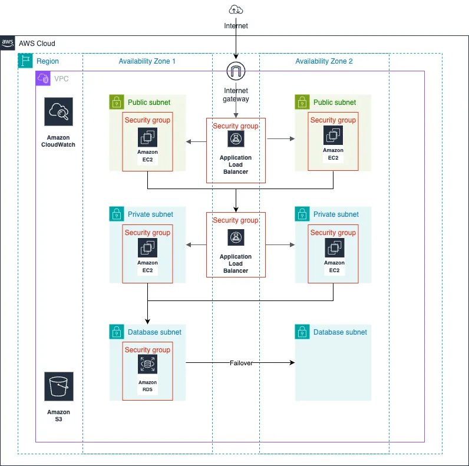
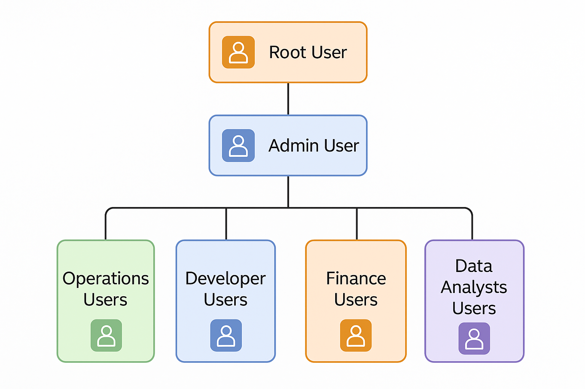
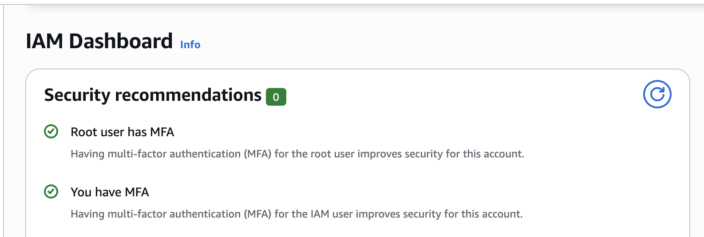
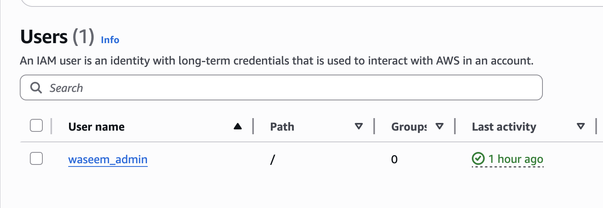

# 🔹 Project Summary – Cloud Security Transformation using Terraform

    Spearheaded a cloud security remediation initiative at StartupCo, addressing critical risks caused by shared AWS root account usage and lack of governance.

    Conducted a rapid cloud security assessment, presented risk findings to stakeholders, and secured alignment for a phased security transformation plan.

## Eliminated root account dependencies by:

        Enforcing Multi-Factor Authentication (MFA)

        Creating secure break-glass access procedures

        Provisioning a new IAM admin user for daily operations
## Designed and implemented role-based IAM access using Terraform Infrastructure as Code (IaC):

        Created IAM groups and users for Developers, Operations, Finance, and Analysts

        Applied least-privilege policies to each group via modular Terraform scripts

    Enforced MFA and strong password policies across all IAM users to meet security compliance standards.

    Enabled AWS CloudTrail, AWS Config, and centralized encrypted logging for full auditability and compliance tracking.

    Integrated IAM roles into CI/CD pipelines, ensuring secure automation and governance at scale.

## Achieved:

        100% IAM onboarding compliance

        Zero root account usage in operations

        A secure, scalable AWS foundation governed entirely via Terraform

Project Brief
Created IAM Users and Groups
* Developer group & users
* Operations group & users
* Finance group & users
* Analyst group & users

Team Structure & Access Needs: 
*   4 Developers (need EC2 and S3 access)
*  2 Operations (need full infrastructure access)
*  2 Finance Manager (needs cost management access)
*  3 Data Analysts (need read-only access to data resources)



Secure Storage of Root Credentials: The root account credentials were securely stored following AWS best practices, accessible only in break-glass scenarios.



Set Up Security Requirements
* Enable MFA for all users
* Create a strong password policy
* Ensure users can only access what they need

Implemented  Permissions

Developers:
* EC2 management
* S3 access for application files
* CloudWatch logs viewing
Operations:
* Full EC2, CloudWatch access
* Systems Manager access
* RDS management
Finance:
* Cost Explorer
* AWS Budgets
* Read-only resource access
Analysts:
* Read-only S3 access
* Read-only database access

🔰 Project Kick-Off: Cloud Security Hardening Initiative
🎯 Primary Objectives:
* 🔒 Secure the AWS Root Account and restrict its usage strictly to emergency scenarios
* 👥 Establish a comprehensive IAM framework with:
    * Individual users
    * Role-based groups
    * Least privilege access policies
* 🏗️ Redesign and implement a resilient and secure AWS infrastructure
* 📦 Introduce Infrastructure as Code (IaC) using Terraform to manage IAM resources in a consistent, auditable, and scalable way
* 🛡️ Enforce foundational security controls such as:
    * Multi-Factor Authentication (MFA)
    * Strong password policies



✅ Provisioned a new IAM user with administrative privileges to eliminate reliance on the AWS root account for daily operations



Establishing Fine-Grained Access Control with IAM
A critical component of this project was to design and implement a scalable IAM architecture rooted in the principle of least privilege — ensuring that each user receives only the permissions necessary to fulfill their job responsibilities.
Key actions included:
* 🧩 Defined role-based IAM groups to simplify permission management and promote operational governance
* 👥 Created separate IAM groups for each functional team, including:
    * Developers

    * Operations
    * Finance
    * Data Analysts

